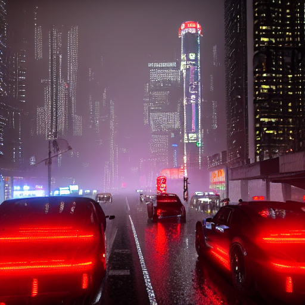

# Stable Diffusion Local Inference

Local text-to-image generation using Stable Diffusion models via the Diffusers library. Includes GPU vs CPU performance comparison and model benchmarking.

## Models Used

| Model | Parameters | Resolution | VRAM |
|-------|-----------|------------|------|
| SD v1-5 | 860M | 512×512 | ~4 GB |
| SDXL 1.0 | 3.5B | 1024×1024 | ~8 GB |
| Juggernaut XL | 3.5B | 1024×1024 | ~8 GB |

## Results

### SD v1-5 — CPU (56 threads, Xeon E5-2690 v4 ×2)


Generation time: ~600s

### SD v1-5 — GPU (RTX 3060 12GB)


Generation time: ~5s

### SDXL — GPU (RTX 3060 12GB)


Generation time: ~48s

## Hardware

- CPU: 2× Intel Xeon E5-2690 v4 (56 threads total)
- GPU: NVIDIA GeForce RTX 3060 12GB
- RAM: 64GB

## Setup

```bash
conda create -n sd-env python=3.11 -y
conda activate sd-env

pip install torch==2.1.2 torchvision==0.16.2 --index-url https://download.pytorch.org/whl/cu118
pip install diffusers==0.31.0 transformers==4.40.0 accelerate==0.30.0 numpy==1.26.4 Pillow
```

## Notebooks

| File | Model | Device | Description |
|------|-------|--------|-------------|
| `hw9_m_gpu.ipynb` | SD v1-5 | GPU | DPM++ scheduler, fp16 |
| `hw9_m_cpu.ipynb` | SD v1-5 | CPU | 56 threads, float32 |
| `hw9_movsar_sdxl.ipynb` | SDXL 1.0 | GPU | 1024×1024, fp16 |
| `M-task9.ipynb` | SD v1-5 | GPU/CPU | Auto-detect device |

## Key Concepts

- **Scheduler** — algorithm that controls the denoising process (DPM++, DDIM)
- **fp16** — half-precision float, reduces VRAM usage by 2×
- **Seed** — fixed random state for reproducible results
- **CFG scale** — how strictly the model follows the prompt

## Prompt Used

```
A sprawling cyberpunk megacity at midnight, rain-slicked streets reflecting
cascades of neon signs in Cyrillic and Japanese, towering brutalist skyscrapers
wrapped in holographic banners, hovercars threading between lit windows,
volumetric fog, ultra-detailed, cinematic 4k, photorealistic render
```

## GPU vs CPU Comparison

| Metric | GPU (RTX 3060) | CPU (2× Xeon E5-2690 v4) |
|--------|---------------|--------------------------|
| Time (25 steps, 512×512) | ~5s | ~600s |
| Precision | float16 | float32 |
| VRAM / RAM used | ~4GB VRAM | ~8GB RAM |
| Speedup | 120× faster | baseline |